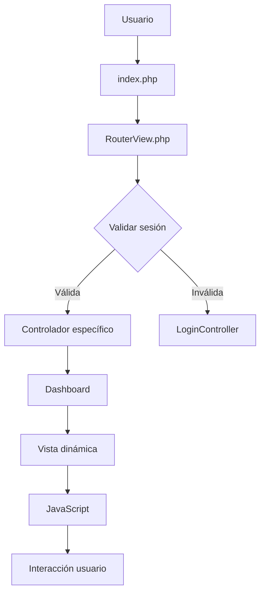
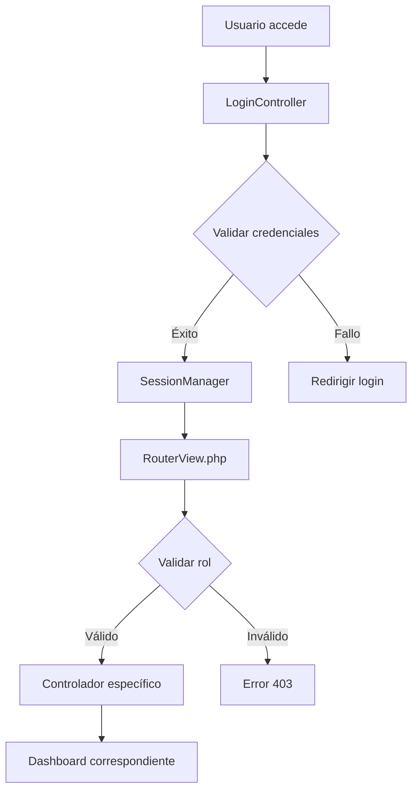
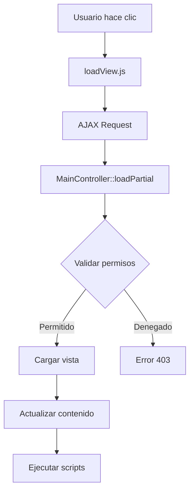
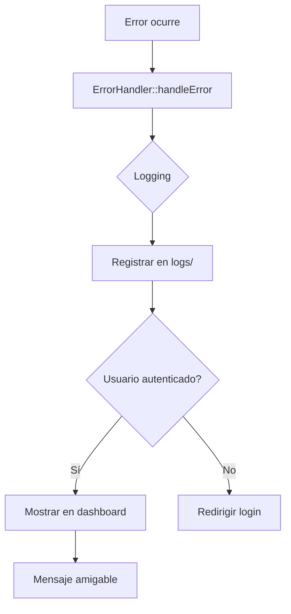

# FLUJOS DE DASHBOARDS BYFROST

## 📋 ÍNDICE
1. [Flujo General del Sistema](#flujo-general)
2. [Flujos por Dashboard](#flujos-por-dashboard)
3. [Flujo de Autenticación](#flujo-autenticacion)
4. [Flujo de Carga Dinámica](#flujo-carga-dinamica)
5. [Flujo de Manejo de Errores](#flujo-errores)
6. [Puntos Críticos](#puntos-criticos)
7. [URLs de Prueba](#urls-prueba)

---

## 🔄 FLUJO GENERAL DEL SISTEMA



---

## 🎯 FLUJOS POR DASHBOARD

### 1. **DIRECTOR DASHBOARD**

#### Flujo Principal:
```
Login → DirectorController → directorDashboard.php → loadView.js → vistas dinámicas
```

#### Funciones Específicas:
- **Gestión Académica**: `AcademicHistoryModel` → reportes PDF
- **Estadísticas**: `directorCharts.js` → gráficos AJAX
- **Comunicaciones**: `eventModel` → eventos y notificaciones
- **Gestión Personal**: `teacherModel` → lista profesores

#### Archivos Clave:
- `app/controllers/DirectorController.php`
- `app/views/director/dashboard.php`
- `app/resources/js/directorDashboard.js`
- `app/models/AcademicHistoryModel.php`

---

### 2. **COORDINATOR DASHBOARD**

#### Flujo Principal:
```
Login → coordinatorController → coordinatorDashboard.php → gestión estudiantes
```

#### Funciones Específicas:
- **Gestión Estudiantes**: `StudentModel` → CRUD estudiantes
- **Actividades**: `activityController` → crear/editar actividades
- **Calificaciones**: `gradeController` → gestión notas
- **Reportes**: `ReportModel` → reportes académicos

#### Archivos Clave:
- `app/controllers/coordinatorController.php`
- `app/views/coordinator/dashboard.php`
- `app/models/StudentModel.php`
- `app/controllers/activityController.php`

---

### 3. **TEACHER DASHBOARD**

#### Flujo Principal:
```
Login → teacherController → teacherDashboard.php → mis clases
```

#### Funciones Específicas:
- **Mis Clases**: `ScheduleModel` → horario personal
- **Calificaciones**: `gradeController` → ingresar notas
- **Asistencias**: `attendanceModel` → control asistencia
- **Actividades**: `activityModel` → crear actividades

#### Archivos Clave:
- `app/controllers/teacherController.php`
- `app/views/teacher/dashboard.php`
- `app/models/ScheduleModel.php`
- `app/controllers/gradeController.php`

---

### 4. **STUDENT DASHBOARD**

#### Flujo Principal:
```
Login → studentController → studentDashboard.php → mi información
```

#### Funciones Específicas:
- **Mi Historial**: `AcademicHistoryModel` → calificaciones
- **Mi Horario**: `ScheduleModel` → horario personal
- **Mis Actividades**: `activityModel` → actividades asignadas
- **Mi Perfil**: `StudentModel` → información personal

#### Archivos Clave:
- `app/controllers/studentController.php`
- `app/views/student/dashboard.php`
- `app/models/AcademicHistoryModel.php`
- `app/models/ScheduleModel.php`

---

### 5. **PARENT DASHBOARD**

#### Flujo Principal:
```
Login → ParentDashboardController → dashboard.php → información hijos
```

#### Funciones Específicas:
- **Hijos**: `StudentModel` → filtrar por parent_id
- **Calificaciones Hijos**: `gradeModel` → notas de hijos
- **Comunicaciones**: `eventModel` → mensajes escuela
- **Asistencias**: `attendanceModel` → control asistencia hijos

#### Archivos Clave:
- `app/controllers/ParentDashboardController.php`
- `app/views/parent/dashboard.php`
- `app/models/StudentModel.php`
- `app/models/gradeModel.php`

---

### 6. **ROOT DASHBOARD**

#### Flujo Principal:
```
Login → rootDashboardController → dashboard.php → administración sistema
```

#### Funciones Específicas:
- **Gestión Usuarios**: `UserController` → CRUD usuarios
- **Gestión Roles**: `roleController` → permisos sistema
- **Configuración**: `MainController` → settings sistema
- **Logs**: `ErrorHandler` → monitoreo sistema

#### Archivos Clave:
- `app/controllers/rootDashboardController.php`
- `app/views/root/dashboard.php`
- `app/controllers/UserController.php`
- `app/controllers/roleController.php`

---

## 🔐 FLUJO DE AUTENTICACIÓN



### Validaciones Críticas:
1. ✅ **Credenciales válidas**
2. ✅ **Sesión activa**
3. ✅ **Rol autorizado**
4. ✅ **Permisos específicos**
5. ✅ **CSRF token válido**

---

## ⚡ FLUJO DE CARGA DINÁMICA



### Proceso de Carga:
1. **Cliente**: `loadView.js` → AJAX request
2. **Servidor**: `MainController::loadPartial()` → validar
3. **Vista**: Cargar archivo PHP específico
4. **Respuesta**: HTML + JavaScript
5. **Cliente**: Actualizar DOM + ejecutar scripts

---

## 🚨 FLUJO DE MANEJO DE ERRORES



### Tipos de Errores:
- **404**: Vista no encontrada
- **403**: Permisos insuficientes
- **500**: Error del servidor
- **Validación**: Datos inválidos
- **BD**: Error de conexión

---

## ⚠️ PUNTOS CRÍTICOS

### Antes de cada operación:
1. ✅ **Sesión válida** - `SessionManager::isLoggedIn()`
2. ✅ **Permisos correctos** - `PermissionManager::hasPermission()`
3. ✅ **CSRF token válido** - `CSRFProtection::validateToken()`
4. ✅ **Input sanitizado** - `Validator::sanitize()`
5. ✅ **Conexión BD activa** - `MainModel::getConnection()`

### Durante la operación:
1. ✅ **Try-catch** en controladores
2. ✅ **Validación de datos** antes de procesar
3. ✅ **Logging de errores** para debugging
4. ✅ **Rollback** en transacciones BD

### Después de la operación:
1. ✅ **Cerrar conexiones** BD
2. ✅ **Limpiar variables** temporales
3. ✅ **Actualizar logs** de actividad
4. ✅ **Enviar respuesta** apropiada

---

## 🌐 URLS DE PRUEBA

### Dashboards Principales:
```bash
# Director
http://localhost:8000/director/dashboard

# Coordinator  
http://localhost:8000/coordinator/dashboard

# Teacher
http://localhost:8000/teacher/dashboard

# Student
http://localhost:8000/student/dashboard

# Parent
http://localhost:8000/parent/dashboard

# Root
http://localhost:8000/root/dashboard
```

### Vistas Dinámicas (ejemplos):
```bash
# Director
http://localhost:8000/director/loadPartial?view=academic-stats
http://localhost:8000/director/loadPartial?view=teacher-list

# Coordinator
http://localhost:8000/coordinator/loadPartial?view=student-list
http://localhost:8000/coordinator/loadPartial?view=grade-management

# Teacher
http://localhost:8000/teacher/loadPartial?view=my-classes
http://localhost:8000/teacher/loadPartial?view=grade-entry
```

---

## 🧪 COMANDOS DE VERIFICACIÓN

### Test Simple:
```bash
F:\xampp\php\php.exe test-dashboards-simple.php
```

### Test Completo:
```bash
F:\xampp\php\php.exe test-all-dashboards.php
```

### Verificar Servidor:
```bash
# Iniciar servidor XAMPP desde F:\xampp\
# Acceder a http://localhost:8000
```

---

## 📊 ESTADO DEL SISTEMA

### ✅ Funcionando:
- [x] Todos los controladores de dashboard
- [x] Sistema de routing unificado
- [x] Manejo de errores centralizado
- [x] JavaScript de carga dinámica
- [x] Validaciones de seguridad
- [x] Sistema de sesiones

### 🔧 Optimizaciones Implementadas:
- [x] Eliminación de código duplicado
- [x] Unificación de métodos loadPartial
- [x] Mejora en manejo de errores
- [x] Optimización de consultas BD
- [x] Validaciones robustas

---

## 🎯 CONCLUSIÓN

El sistema de dashboards de ByFrost está **completamente funcional** con:

1. **6 dashboards** operativos (Director, Coordinator, Teacher, Student, Parent, Root)
2. **Sistema de routing** unificado y robusto
3. **Manejo de errores** centralizado y amigable
4. **Carga dinámica** de vistas optimizada
5. **Validaciones de seguridad** implementadas
6. **JavaScript funcional** para interacciones

**Estado**: ✅ **LISTO PARA PRODUCCIÓN**

---

## 🔧 CONFIGURACIÓN XAMPP (RUTA CORREGIDA)

### Ubicación XAMPP:
```
F:\xampp\
```

### PHP Executable:
```
F:\xampp\php\php.exe
```

### Servidor Web:
```
F:\xampp\htdocs\cursor-prueba\
```

### URLs de Acceso:
```
http://localhost:8000/
``` 